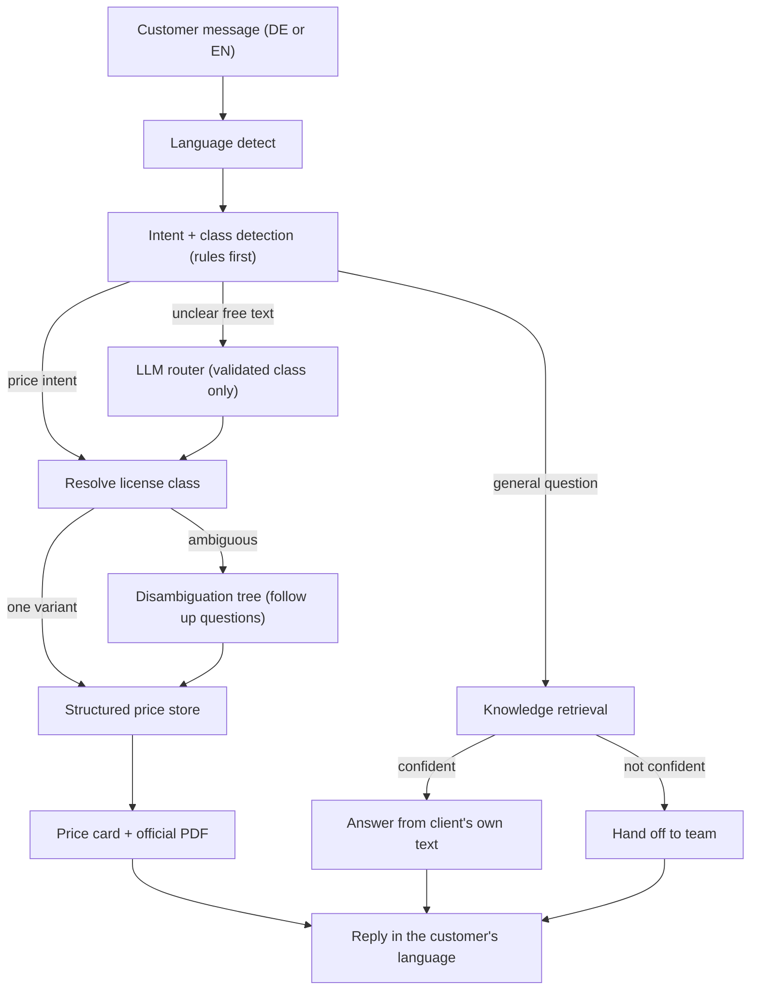

# Project Documentation: German Driving School Chatbot

A production grade, bilingual (German and English) chatbot that answers customer
questions about driving license classes, prices, and enrollment for a German driving
school (a "Fahrschule"). The system is built around one non negotiable principle: it
must never give a wrong price.

This document explains what the project does, why it is designed the way it is, and
how every part works, so that both a non technical reader and an engineer can
understand the whole system.

---

## 1. Executive summary

A German driving school wanted a customer facing assistant that could answer pricing
and general questions accurately, in the customer's own language, at any hour. Driving
license pricing is exact and safety critical for the business, so the usual approach of
letting a language model generate answers was not acceptable: language models can invent
numbers, and a single wrong price shown to a customer is a real business problem.

The solution separates the system into a deterministic core and a language layer. All
prices come from a structured, human verifiable store that is validated against the
original documents. The language model is used only to understand messy free text and to
translate, never to produce a price. The result is a chatbot that behaves naturally,
speaks German and English, asks clarifying questions when needed, delivers the official
price sheet as a downloadable PDF, and is provably accurate.

Verified outcomes:

- All 44 official price sheets integrated and checked against their source PDFs, with
  zero mismatches.
- 100 percent price accuracy enforced automatically on every code change.
- Bilingual: German questions get German answers, English questions get English answers.
- Guided follow up questions for classes with multiple variants (for example Class B).
- Resistant to adversarial input: no injection, role play, or edge case could make it
  state a wrong or invented price.
- 80 automated tests, a dedicated evaluation gate, and a one command Docker deployment.

---

## 2. The problem and the goal

The client offers a large catalogue of German driving license classes. Each class can
have several variants (for example, a car license can be a standard manual course, an
automatic course, a course combined with a trailer entitlement, a conversion of a foreign
license, and more). Every variant has its own official price sheet.

The goal was an assistant that:

1. Answers pricing questions with the exact, current price for the correct variant.
2. Asks the right follow up questions when a request is ambiguous.
3. Answers general questions (opening hours, required documents, registration process).
4. Replies in the language the customer used.
5. Sends the official price sheet as a document or downloadable link.
6. Never gives a wrong answer.

---

## 3. Key requirements

| Requirement | How it is met |
| --- | --- |
| Integrate all pricing documents | 44 price sheets parsed into a structured store |
| Preprocess data before loading into any vector store | A dedicated extraction and verification pipeline runs first |
| Short term memory | Each conversation keeps a session with filled in "slots" |
| Follow up questions for pricing | Curated decision trees narrow a class to one variant |
| German in, German out; English in, English out | Automatic language detection and bilingual replies |
| Pricing documents delivered as a download | A document endpoint serves the official PDF |
| Never give a wrong answer | Prices come only from a verified store, validated against the source |

---

## 4. What the system does (features)

- **Exact pricing.** For any license class and variant, it returns the exact total,
  a full itemized breakdown (base fee, lessons, special drives, exam fees), a note about
  external fees that the school does not charge, and a link to the official PDF.
- **Guided disambiguation.** When a request could mean several variants, the bot asks
  short, clear questions (for example: new license or special case, car only or combined
  with another class, manual or automatic) until exactly one variant remains.
- **General question answering.** It answers questions such as opening hours, required
  documents, document validity, simulator availability, and registration steps, using the
  client's own written material.
- **Bilingual conversation.** It detects German or English automatically and mirrors the
  language, including a faithful translation of German information into English.
- **Document delivery.** Every pricing answer includes a downloadable official price sheet.
- **Safe fallback.** When it is not confident, it hands the customer off to the team
  rather than guessing.

### Example interactions

A pricing conversation (German):

```
Customer: Was kostet Klasse B?
Bot:      Is this a new license or a special case?  [options]
Customer: New license
Bot:      Car only, or combined with another class?  [options]
Customer: Car only
Bot:      Manual or automatic?  [options]
Customer: Automatic
Bot:      Shows the exact total for the automatic variant, an itemized breakdown,
          the external fee note, and a Download price sheet (PDF) button.
```

A general question (English input):

```
Customer: What documents do I need to register?
Bot:      Identity card or passport; for minors, additional consent of the guardian.
```

---

## 5. Architecture: the design that guarantees accuracy

The single most important design decision is that the language model never produces a
price. The system is split into two cooperating parts.

- **A deterministic core** owns all facts. Prices live in a structured store that was
  extracted from the official documents and verified against them. Class resolution and
  the follow up question logic are rule based and fully testable.
- **A language layer** helps only with understanding and phrasing. It classifies intent,
  maps unusual free text to a known class, and translates. It has no authority over facts.



Key point: every euro amount in a reply travels the path on the right (Resolve, Store,
Price card). It is never generated by the model. A misunderstanding can send the customer
down the wrong branch (which leads to another question or a handoff), but it can never
produce a wrong number.

---

## 6. How it works, component by component

### 6.1 Data pipeline (preprocessing before any vector store)

The raw material is a set of official PDF documents: the price sheets, a business
information questionnaire, and consultation documents. The pipeline processes these before
anything is loaded into a search index.

1. **Manifest and taxonomy.** Every file is catalogued (class, variant, date, document
   type). A taxonomy of German license classes is built. Codes whose meaning is not certain
   are flagged for client confirmation rather than guessed.
2. **Price extraction.** Each price sheet has a very regular layout (an itemized offer with
   a totals block). A deterministic parser reads every line item and the totals using exact
   patterns, with no language model involved. It handles real world quirks such as optional
   value added tax lines, decimal training hours, participant units, and multi page carry
   overs.
3. **Automatic self verification.** Each sheet is internally consistent: the net amount plus
   value added tax equals the grand total, and the sum of the line items equals the grand
   total. The parser checks both. If a value is misread or a line is dropped, the equation
   breaks and the sheet is flagged. All 44 sheets pass both checks.
4. **Knowledge extraction.** The business questionnaire and consultation documents are turned
   into clean, retrievable passages and question and answer pairs.
5. **Versioning.** When two generations of a price sheet exist, the newest is marked current
   and the older is archived so an outdated price is never served.

### 6.2 Structured price store and query layer

The verified prices are loaded into a small database and exposed through a deterministic
query layer with four operations:

- Get the exact price record for a specific variant (archived variants are withheld).
- List the variants of a base class (used to build follow up questions).
- Get the downloadable document link for a variant.
- Resolve free text to a license class, or report that it is ambiguous and needs a follow up.

By design, asking about a bare class that has many variants (for example a car license)
returns "ambiguous", which triggers the follow up questions rather than a guessed answer.

### 6.3 Disambiguation trees (the follow up questions)

For each class with multiple variants, a curated decision tree drives the follow up
questions. A short sequence of questions narrows the request to exactly one variant. The
trees were derived from the client's own consultation material.

An automated test guarantees that the set of variants reachable through the trees is exactly
equal to the set of current variants in the store. This means no price is unreachable and no
branch leads to a dead end.

### 6.4 Knowledge base and hybrid retrieval

General questions are answered from the client's own written material, so the answer is
always the client's real text and can never be invented. Retrieval uses two methods together:

- **Keyword search (BM25)** with German aware normalization, for exact term matches.
- **Semantic search (embeddings)** for questions phrased differently from the source text.

The two are blended: embeddings propose candidate passages, and keyword scoring re ranks them
so that the passage which actually contains the question's terms wins. If the system is not
confident, it hands off to the team instead of returning a weak match. This precision first
policy means the bot would rather say "let me connect you to the team" than show a wrong answer.

### 6.5 Language layer (bounded use of the model)

The language model is used for two narrow tasks:

- **Intent and class routing.** When the rule based layer cannot map a free text message to a
  class, the model proposes a class. The proposal is validated against the known list of
  classes, so the model cannot introduce an unknown class, and it never returns a price.
- **Translation.** German information is translated into English for English speaking customers,
  with an explicit instruction to preserve every number, time, and address.

If no model key is configured or a call fails, the system falls back to its deterministic
behaviour. Nothing about pricing depends on the model.

### 6.6 Dialogue engine (memory and language)

The dialogue engine ties everything together. It detects the language, classifies the intent,
routes to pricing or to knowledge, walks the follow up questions, formats the reply, and hands
off when needed. It keeps a short term memory per session: once the customer has answered a
question, that answer is remembered as a filled slot and is not asked again. Separate
conversations are fully isolated from each other.

### 6.7 API and web widget

A web service exposes the engine over a small set of endpoints, and serves an embeddable chat
widget with a German and English toggle, clickable option buttons, an itemized price card, and
a Download price sheet button.

| Method | Path | Purpose |
| --- | --- | --- |
| GET | `/` | The embeddable web chat widget |
| POST | `/api/session` | Start a conversation, returns the greeting |
| POST | `/api/message` | Send a message or an option choice, returns the next reply |
| GET | `/api/document/{variant}` | Download the official price sheet PDF (current only) |
| GET | `/api/health` | Liveness and number of price sheets loaded |

---

## 7. The "never wrong" guarantees

Accuracy is enforced at every layer, not assumed.

1. **Prices are never generated.** They are read verbatim from the verified store.
2. **Extraction is self checked.** Net plus tax equals total, and the line items sum to the
   total, on all 44 sheets.
3. **Served prices match the source.** An automated test re parses the grand total directly
   from each source PDF with a second parser and compares it to what the bot serves. Any
   difference fails the build.
4. **Ambiguity is a stop.** A class with several variants is never answered until a single
   variant is chosen.
5. **Freshness.** Only current price sheets are served; superseded sheets are archived.
6. **General answers are grounded.** They are the client's own text, gated by a confidence
   threshold; below it, the bot hands off.
7. **Refusal over guessing.** Unknown classes, discount requests, and nonsense never produce a
   price. They lead to a question or a handoff.

---

## 8. Testing and quality assurance

The project is validated at three levels.

- **Unit and integration tests (80 tests).** Cover the taxonomy parser, the store and its
  resolution logic, the disambiguation trees, the dialogue flows in both languages, the
  knowledge retrieval, the language layer (with a fake model, so tests make no live calls),
  the semantic index, and the web API.
- **Evaluation gate.** A curated set of the client's own example questions plus adversarial
  probes runs end to end. The price baseline (every current variant equals its signed off
  value) and the query cases all pass.
- **Ground truth price gate.** Every served price is compared to the grand total re parsed
  directly from the source PDF. This is the strongest check, because it verifies agreement
  with the official document itself, not merely internal consistency.

A dedicated rigorous testing pass exercised the system with tricky phrasings, typos, mixed
language input, prompt injection and role play attempts, empty and huge inputs, emoji, and
database style inputs. Two real defects were found and fixed during that pass (an umlaut
handling bug in the tokenizer, and an off topic result from semantic search), and retrieval
quality was improved. After the fixes, all checks pass: 44 of 44 prices match the source PDFs,
and no adversarial input could produce a wrong or invented price.

---

## 9. Security and confidentiality

The client's documents are confidential. They contain business details and, in some documents,
bank and tax identifiers. The project treats them accordingly.

- The entire data folder (source PDFs and everything derived from them, including extracted
  prices) is excluded from version control and never published.
- Only application code, schemas, tests, and documentation are public.
- Secrets (the model API key, the handoff email, the business name) are read from a local
  environment file that is excluded from version control and is never committed.
- The client's business name is configured at runtime, not written into the code.
- Every code change is scanned to confirm that no data, secret, or price value is committed.

---

## 10. Deployment

The application ships as a small container image that holds only application code. The
confidential data is mounted as a read only volume at run time, and secrets are provided through
the environment. This keeps the image portable and the data private.

Typical run:

```
docker compose up --build
# then open http://localhost:8123/
```

For hosting, a long running container platform with a persistent private disk for the data and
platform managed secrets is recommended. The health endpoint is used for readiness checks.
Serverless platforms are not recommended because the service needs a persistent, private data
volume.

---

## 11. Technology stack

| Area | Technology |
| --- | --- |
| Language | Python |
| Web service | FastAPI and Uvicorn |
| PDF parsing (offline pipeline) | pdfplumber |
| Structured store | SQLite |
| Keyword search | BM25 (custom, dependency free) |
| Semantic search | OpenAI embeddings, cached to disk |
| Language layer | OpenAI model, used only for routing and translation |
| Frontend | Self contained HTML, CSS, and JavaScript widget |
| Packaging | Docker and Docker Compose |
| Tests | Python standard library test framework |

The choice to use hosted embeddings and a hosted model, rather than local machine learning
libraries, keeps the runtime light and avoids heavy local dependencies.

---

## 12. Repository structure

```
.
├── data/            LOCAL ONLY, git ignored: source PDFs and derived data
│   ├── raw/         the client PDFs
│   ├── interim/     intermediate artifacts (manifest, probes)
│   ├── processed/   verified price store, knowledge base, embeddings cache
│   └── golden/      evaluation baselines
├── src/fahrschule/  application code
│   ├── taxonomy.py         license class knowledge
│   ├── store.py            price store and query layer
│   ├── disambiguation.py   follow up decision trees
│   ├── knowledge.py        hybrid FAQ retrieval
│   ├── embeddings.py       semantic index
│   ├── llm.py              bounded language model adapter
│   ├── dialogue.py         conversation engine (DE and EN, memory)
│   ├── api.py              web service
│   └── web/index.html      embeddable chat widget
├── scripts/         the offline data pipeline and the evaluation report
├── tests/           unit, integration, evaluation, and ground truth tests
├── docs/            this documentation, the build plan, and the deploy guide
├── Dockerfile, docker-compose.yml, .dockerignore
└── requirements.txt, requirements-api.txt
```

---

## 13. Results

- 44 official price sheets integrated, parsed, and verified.
- 100 percent of served prices match their source PDFs.
- 42 current variants available, with 2 older generation sheets correctly archived.
- Full German and English support with automatic language mirroring.
- Guided follow up questions covering every variant of every multi variant class.
- 80 automated tests and a full evaluation suite passing.
- One command containerized deployment with data kept private.
- Verified resistant to adversarial and injection input.

---

## 14. Future enhancements

These are optional and not required for the current scope.

- Extract the large truck price display poster, which uses a different layout.
- Expand the bilingual glossary and add more languages.
- Add a messaging channel integration (for example WhatsApp) as a thin layer that calls the
  existing service.
- Restrict the web service to the client's domain in production.
- Add load testing and monitoring dashboards.

---

## 15. Glossary of German terms

| German | Meaning |
| --- | --- |
| Fahrschule | Driving school |
| Führerschein | Driving license |
| Klasse | Class (license category) |
| Grundbetrag | Base fee (covers theory and general costs) |
| Übungsstunde | Practice driving lesson |
| Sonderfahrt | Special drive (overland, motorway, or night) |
| Prüfung | Exam (theory or practical) |
| Anhänger | Trailer |
| Umschreibung | Conversion of a foreign or older license |
| Wiedererteilung | Re issuance of a license after withdrawal |
| Schaltung / Automatik | Manual / automatic transmission |
| Öffnungszeiten | Opening hours |
| Gesamtbetrag | Grand total |
